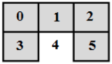

##Robot Localization Animation
##What you need to know
In this project you will practice implementation of an algorithm for a robot localization problem (see [Documentation](/Documentation/Example.pdf), example 3 for the algorithm description). Given a grid world, a sensory error and a sequence of observations, a robot must
estimate the room it is in at the time of the last observation.

A grid world is represented by an n x m matrix M of integers, each of which in binary shows that there are obstacles in
directions <North, South, West, East> (in this order). In other words, M[i][j] = 10 means that at location [i][j] of the grid
there are obstacles to the North and West of this location (since 10 in binary is 1010 and binary 1 represents an
obstacle). A sequence of observations is given in capital letters: NW, NS, for example. NW means that there are
obstacles to the North and West.

The matrix M is given in the input file “[input.txt](Tests/input1.txt)” and the sensory error together with a sequence of observations are
given in a command line.

For example, if the content of input.txt file is:
<pre>
10 12 9
7 15 7
</pre>
Then the corresponding Grid World is:

####Testing Your Program
Once you compile your program, run your executable.  Assuming it is named "robot," test your program with the following:
<pre>
./robot input.txt 0.1 NW NS
</pre>
In the above example,  
  * **input.txt** stores the information of your grid world
  * **0.1** represents the *sensory error*
  * **NW** **NS** is the *given sequence of observations* at time 1 and 2

The output of the program should be:  
<pre>
(0, 1) 0.998408
</pre>

The output shows that the robot is in row **0** and column **1** of the grid world and that the state *estimation probability* at time 2 at this location equals to **0.998408**, the maximum state estimation probability over all locations.

If more than one location has the maximum probability, output all of the locations corresponding to the maximum state estimation probability in the format shown above (one location per line).

##Examples

####Directional Input Examples
* **Obstacle = 1** ( This means that you cannot move to an open space, Labeled White )
* **Free = 0** ( This means that you can move to an open space, Labeled Grey )  

Directions | Binary
-----------|---------
Given NS | 1100
Given NSW| 1110
Given NE | 1010
Given EW | 0011

From these examples, you should easily be able to figure out any other variations.  

####Binary Numbers Reference
Binary | Decimal
-------|-------
0000 | 0
0001 | 1
0010 | 2
0011 | 3
0100 | 4
0101 | 5
0110 | 6
0111 | 7
1000 | 8
1001 | 9
1010 | 10
1011 | 11
1100 | 12
1101 | 13
1110 | 14
1111 | 15

####Development Team (a-z)
Ethan, Jay, Kevin, Spencer
